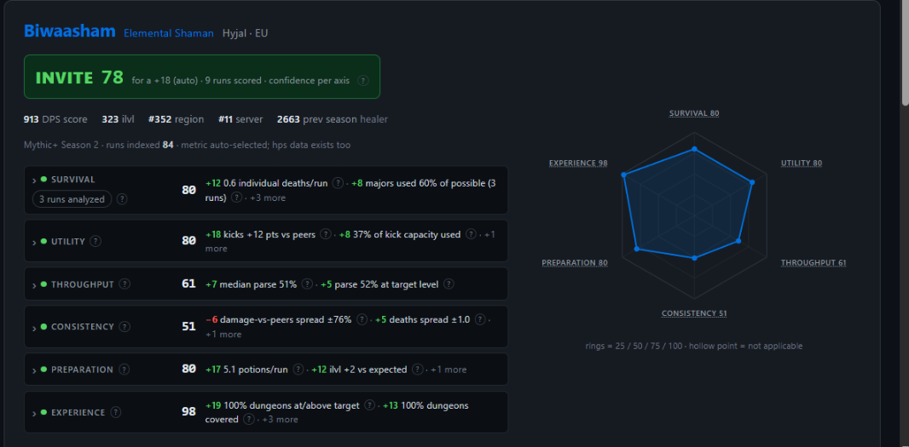
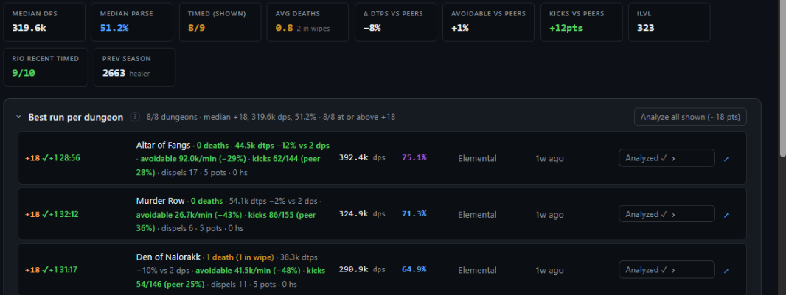

# Better Mythic+ Logs

### Someone applied to your key. Should you invite them?

bmpl reads what Warcraft Logs and Raider.IO already know about a character — every Mythic+ run of the
season, death by death, kick by kick — and answers that one question.

**[→ Open bmpl.riat.dev](https://bmpl.riat.dev)**  ·  sign in with Discord  ·  free  ·  nothing to install

---

## What it tells you

A verdict — **INVITE**, **MAYBE** or **PASS** — with a score out of 100, and the reasons behind it in
plain sentences. It never just says "good player": every line tells you what it saw, so you can
disagree with it.

The score comes from six axes:

| | Axis | What it looks at |
|---|---|---|
| 🛡️ | **Survival** | Do they die, and to what. Deaths, damage taken compared to other players of the same spec, and damage from things they were supposed to dodge |
| 🧰 | **Utility** | Interrupts — measured against what their spec could physically have cast, not a flat count — and dispels |
| ⚔️ | **Throughput** | Their damage or healing, as a percentile against everyone else playing that spec at that key level |
| 📉 | **Consistency** | Whether they play the same way every run, or had one good night |
| 🎒 | **Preparation** | Item level for the key you are asking about, and whether they bring consumables |
| 🗺️ | **Experience** | How much of the season they have actually done at that level, and how recently |

Healers are read on healing, everyone else on damage, automatically. If you do not say which key level
you are vetting for, bmpl works it out from the level they actually play — the median of their best
run per dungeon, not their one lucky +20.

> **When it says INSUFFICIENT DATA, believe it.** Below three usable runs bmpl refuses to give a
> verdict rather than inventing one. That is a real answer: this character has not logged enough for
> anyone to judge them from logs.

Underneath the verdict, every run is there on its own line — what killed them, how much avoidable
damage they ate, how many interrupts they landed against how many they could have:

Every number has a **?** next to it that opens the [Help page](https://bmpl.riat.dev/help), which
explains that number with the thresholds your instance actually uses.

## Your applicants, without typing anything

There is an optional WoW addon. Install it, share your game window with the site once, and **the
people applying to your key appear in bmpl on their own** — name, class, role, score — as they come
in, with the ones bmpl has already vetted marked as such. Click one to open it.

Nothing is sent from the game. The addon has no network code at all: it draws a small grey square of
pixels in the corner of your screen, only while the Group Finder is open, and your browser reads it
off your own screen. It sends nothing, receives nothing, stores nothing.

**[Download the addon](https://github.com/triat/Better-mythic-plus-logs/releases/latest/download/bmpl-addon.zip)** ·
[setup guide and `/bmpl` commands](https://bmpl.riat.dev/help#live-addon)

## Getting in

Go to **[bmpl.riat.dev](https://bmpl.riat.dev)** and sign in with Discord. That is the whole
procedure — no form, no email, no password.

Warcraft Logs limits how much anyone can query per hour, so each member gets a share of the
instance's budget. If you run out, or you vet people all evening, you can plug in your own free
Warcraft Logs client from the Settings page and stop competing with anyone: it takes a minute, and
the Help page walks you through it.

## What bmpl knows about you

- **Your Discord identity** — id, name, avatar. That is what signing in gives it, and all it takes.
- **The characters you looked up**, so your history is there when you come back.
- **Nothing else.** No email, no password, no game account, no combat data of your own.

The people you vet are never stored as people — their runs are cached the way any Warcraft Logs
result is, because that data is public and never changes.

Read the whole thing on the [privacy page](https://bmpl.riat.dev/privacy), and delete your account
yourself from Settings. Deletion is immediate and takes your history with it.

## What it will not do for you

- **It only sees logged runs.** A player who does not log is invisible to it, and that is not a
  verdict on them.
- **It is not an oracle.** It reads one season of one character. Someone can be a good player and
  read PASS because they levelled an alt last week.
- **It does not know your group.** A verdict is about a character's history, not about whether they
  fit the four people you already have.
- **Timed or depleted is deliberately not scored.** A depleted key says as much about the other four
  players as about this one.

## Running your own

bmpl is one binary: a command-line tool, a local web UI, and the hosted service above, all from the
same source. If you want your own — for a guild, or offline — start here:

| | |
|---|---|
| [docs/cli.md](docs/cli.md) | install, Warcraft Logs credentials, every command |
| [docs/scoring.md](docs/scoring.md) | how the verdict is computed, and how to tune the rules |
| [docs/deep-dive.md](docs/deep-dive.md) | the per-run defensive-cooldown analysis |
| [docs/hosted.md](docs/hosted.md) · [deploy/README.md](deploy/README.md) · [docs/operator.md](docs/operator.md) | running a multi-user instance on a VPS |
| [addon/README.md](addon/README.md) | the in-game addon |
| `AGENTS.md` | the developer and AI-agent manual |

Bun ≥ 1.3, TypeScript, React. Avoidable-damage classification courtesy of
[postmortem](https://github.com/Sharpened-Banana/postmortem).
